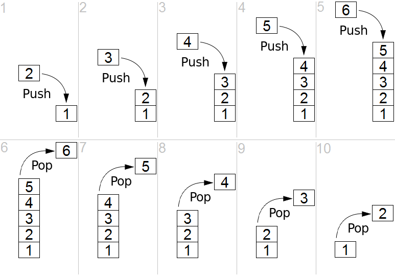

# Michelson Language

# Introduction

---

Michelson is the low level, stack-based programming language used to write smart contracts on the Tezos blockchain. Michelson was designed to facilitate formal verification, allowing users to prove the properties of their contracts.

It uses a stack rewriting paradigm, whereby each function will rewrite an input stack into an output stack (will explain what this means in a while). This runs in a purely functional way and does not modify the inputs at all. Thus, all data structures are **immutable**.

# What is a Stack?

---

A stack is an abstract data type that serves as a collection of elements, with two principal operations: push (adds an element to the collection) and pop (removes the most recently added element that was not yet removed). The order in which elements come off a stack gives rise to its alternative name, LIFO (last in, first out). Additionally, a peek operation may give access to the top without modifying the stack.

Source: Wikipedia.

# Rewriting Stacks

---

To see what rewriting stacks mean, we have to run through a transaction in Michelson. First, before a transaction runs, the blockchain state at a certain hash is deserialized and put onto the stack as the variable `storage`. We have a `from` function that receives the transaction data `amount` , the amount of attached ꜩ, and the `parameter` , the function's parameters.

    from [ (Pair (Pair amount parameter) storage) ]

After running the function, without any updates to the stack, the program will call a `to` function that has the parameters `result`, which is the result of the function, and the output `storage` that is serialized and stored on the blockchain.

    to [ (Pair result storage) ]

In the example, Michelson only manipulates the stack functionally and a new stack is passed from function to function. 

# Why Michelson?

---

At first sight, Michelson is a strange language. It doesn’t include many features like polymorphism, closures, or named functions. Compared to a language like Haskell or OCaml, it seems underpowered; its stack is not always easy to deal with; there is no standard library. However, these restrictions are largely motivated by the language’s design goals.

There are two large motivations for Michelson:

1. To provide readable bytecode
2. To be introspectable

Tezos takes a slightly different view from Ethereum regarding the role of smart contracts. We think of our platform more as a way to implement pieces of business logic than as a generic “world computer”. Looking at Ethereum, most contracts implement things like multisig wallets, vesting and distribution rules, etc. Michelson is targeted to these applications, not the case of arbitrary programs.

Michelson is designed as a readable compilation target, though it can be hand written. The goal is that even the output of a compiler can be understood. We intend the language to be simple enough that developers can build their own analysis tools and compilers should they prefer to do so. This is a departure from the EVM’s bytecode which more closely resembles assembly. With a lower-level bytecode, you usually need confidence in both your program and the compiler toolchain. With Michelson you can more easily check over and verify properties of the program that is actually executed.

Using a higher-level bytecode also simplifies the process of proving properties about the compiled output. Programs written in Michelson can be reasonably analyzed by SMT solvers and formalized in Coq without the need for more complicated techniques like separation logic. Similarly, the restrictions imposed by the forced indentation and capitalization ensure that the source cannot be obfuscated with indentation and alignment tricks.

Our current implementation of Michelson is based around an OCaml GADT, which we have used to verify the type-soundness of the language. Additionally, the implementation of a stack based language maps directly to the semantics. The same is not true for any efficient implementation of the lambda-calculus. There have also been two formally verified implementations of Michelson, one in Coq and one in F*. One day, we hope to replace our current implementation with a verified one.

Finally, one of the main advantages of Tezos is that the system is amendable. We want to start with a small core language in which we are confident and add features as good use cases are created for them. We don't want to throw everything into the language in at the onset and then break backwards compatibility.

So, why Michelson? To provide a straightforward platform for business logic, to provide a readable bytecode, and to be introspectable. When I was working with Olin Shivers, he was very fond of saying that one should always use a "tool small enough for the job". Michelson has been carefully designed to be that tool.