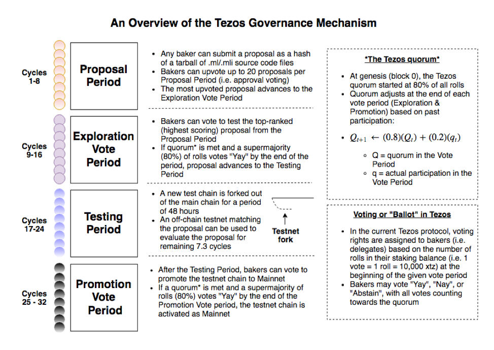

# Self Amendment

# Introduction

Tezos is a self-amending blockchain network which incorporates a formal, on-chain mechanism for proposing, selecting, testing, and activating protocol upgrades without the need to hard fork.,

The self amendment process is split into 4 periods: Proposal Period, Exploration Vote Period, Testing Period and Promotion Vote Period. Each of these four periods lasts eight baking cycles (i.e. 32,768 blocks or roughly 22 days, 18 hours), comprising almost exactly three months from proposal to activation.

Should there be any failure to proceed for a period, the whole process reverts to the Proposal Period, effectively restarting the whole process.

An Overview of the Tezos Governance Mechanism

# How Does It Work?

---

## 1. Proposal Period

The Tezos amendment process begins with the Proposal Period, during which bakers can submit proposals on-chain via the proposal operation, which takes “source”, “period” and “proposals hash” as parameters. The “source” is the baker who submits the proposal operation, the “period” specifies the specific proposal period in which the proposal was submitted, and the “proposals hash” is the hash of the tarball of concatenated .ml/.mli source files.

Bakers may submit up to 20 proposals in each Proposal Period. When submitting a proposal, the baker is also submitting a vote for that proposal, equivalent to the number of rolls in its staking balance at the start of the period. Other bakers can then vote on the proposals by during the Proposal Period up to 20 times.

At the end of the Proposal Period, the network counts the proposal votes and the most-upvoted proposal proceeds to the Exploration Vote Period. If no proposals have been submitted or if there is a tie between proposals, a new Proposal Period begins.

## 2. Exploration Vote Period

In the Exploration Vote Period, bakers may vote on the top-ranked proposal from the previous Proposal Period.

Voting is done on-chain via the Ballot Operation, which allows the baker to vote either "Yes", "No", or "Abstain" on a specific proposal. As in the Proposal Period, a baker’s vote is based on the number of rolls in its staking balance at the *beginning* of the Exploration Vote Period. Each baker may send a ballot operation only once during the voting period.

At the end of eight cycles, the network counts the votes. If voting participation (the total of “Yes,” “No,” and “Abstains”) meets the quorum (explained below) and an 80% supermajority of non-abstaining bakers approves, the proposal proceeds to the Testing Period.

If the quorum or the 80% supermajority are not met, the amendment process reverts to the beginning of the Proposal Period.

A notable difference from the Proposal Period is that after the Exploration Vote Period, the quorum is updated as follows where Q_t is the previous quorum and q_t is the total participation: